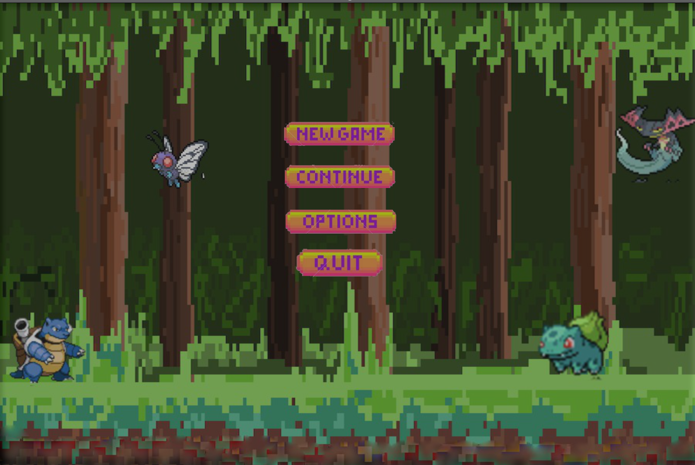
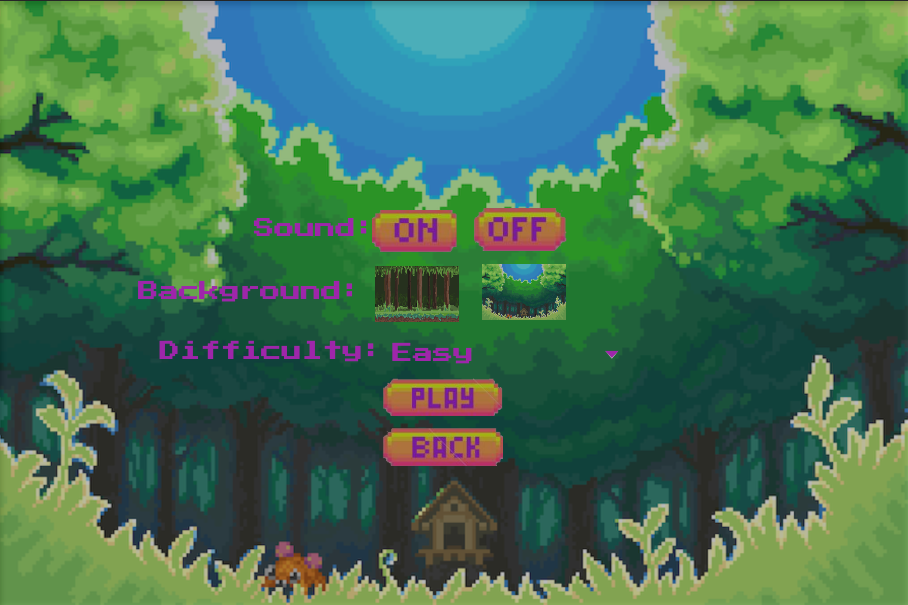
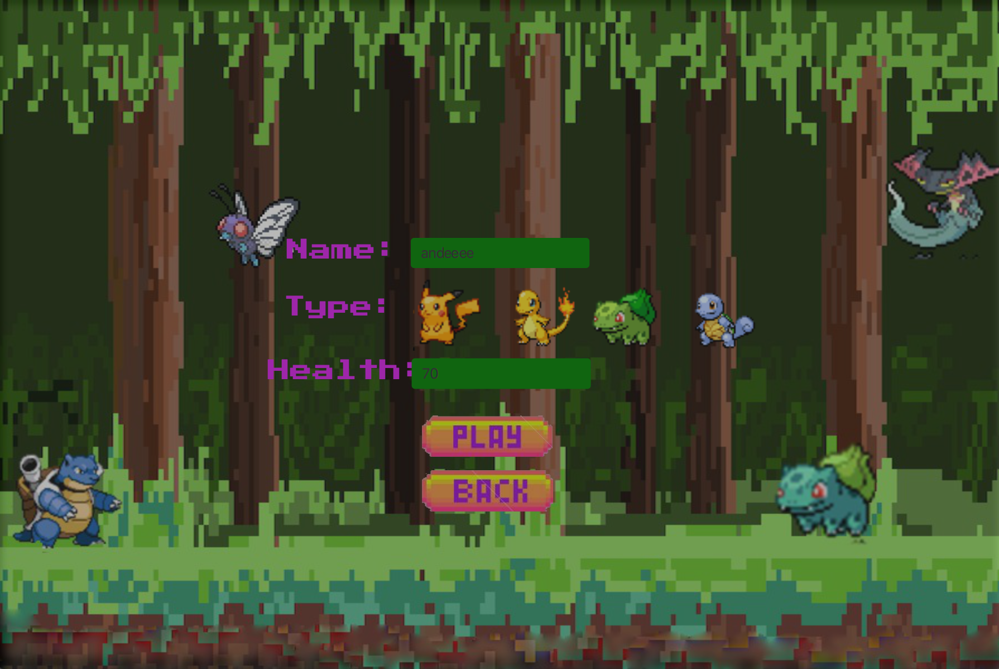
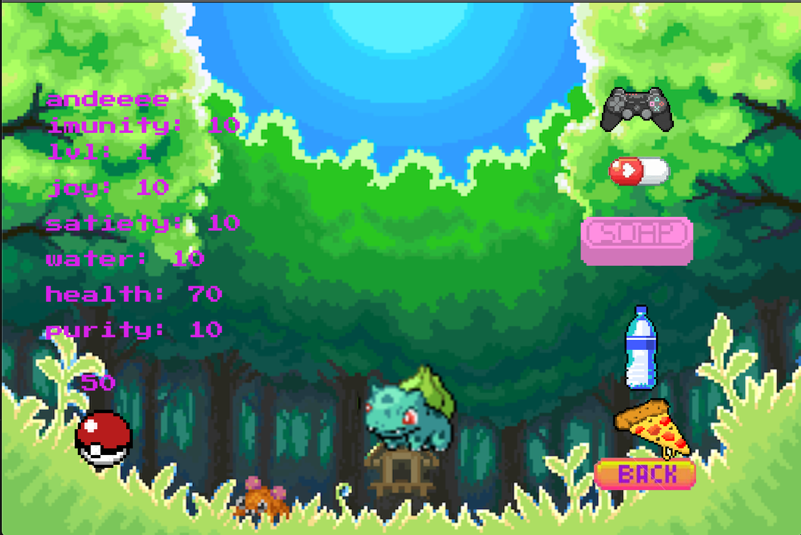
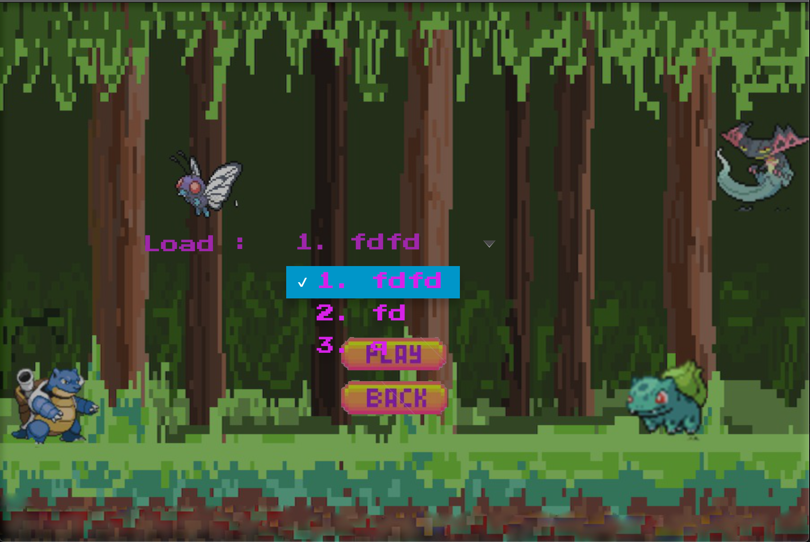
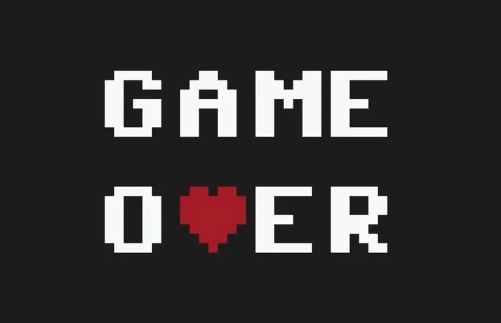

# tamagochi

### Description:
Ucode project: develop game tamagochi.
Tamagochi has a lot of different behaviors models. Hi will be happy if takes a good care!
Or hi may exidentally passed away if you give him a lot of food, can't heal in time or give medicine to healthy creature.

### Implementation:
GUI implemented with JavaFX library and has soundtracks during the game.
Games results can be saved and loaded from database (SQLite).
Game has 5 windows:
- menu;
- new game;
- load game;
- settings:
    - sound: on/off;
    - background;
    - difficulty: easy/normal/hard.
- play window.

### Usage:
```
1. git clone
2. cd tamagochi
3. mvn install
4. mvn javafx:run

```

### Specification:
A tamagotchi has basics characteristics (in the range 0-10):
when characteristics = 0, every move will be helsi drop

Interaction:
- feed (hungry +1, clean -1)
- give water (thirst +1)
- take for a walk (happy +1)
- clean (clean +1)
- give meds (imunity +1)

With time passed all characteristics goes DOWN:
- HARD -1 in minute
- NORMAL -1 in 3 minutes
- EASY -1 in 5 minutes

ALL Character have 2lvl:
- 1lvl: pickachu, chermander, bulbasaur, squirtle
- 2lvl: raichu, charizard, venusaur, blastoise

With time pass 3 random events:
- illness
- pokedex
- qw














